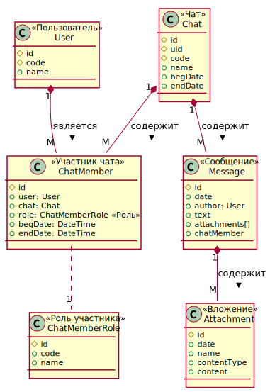

# Чат

## Требования к системе
Сервис "Чат" предназначен для общения пользователей и обмена документами

1. Пользователь отправить сообщение чат с текстом и вложениями 
1. Пользователь видит онлайн все сообщения чата
1. Пользователь получает оповещения о новых сообщениях
1. Пользователь может просмотреть все вложения чата
1. Внешняя система может получить все вложения чата

## Варианты использования системы

## Модель данных

## Модель предметной области

